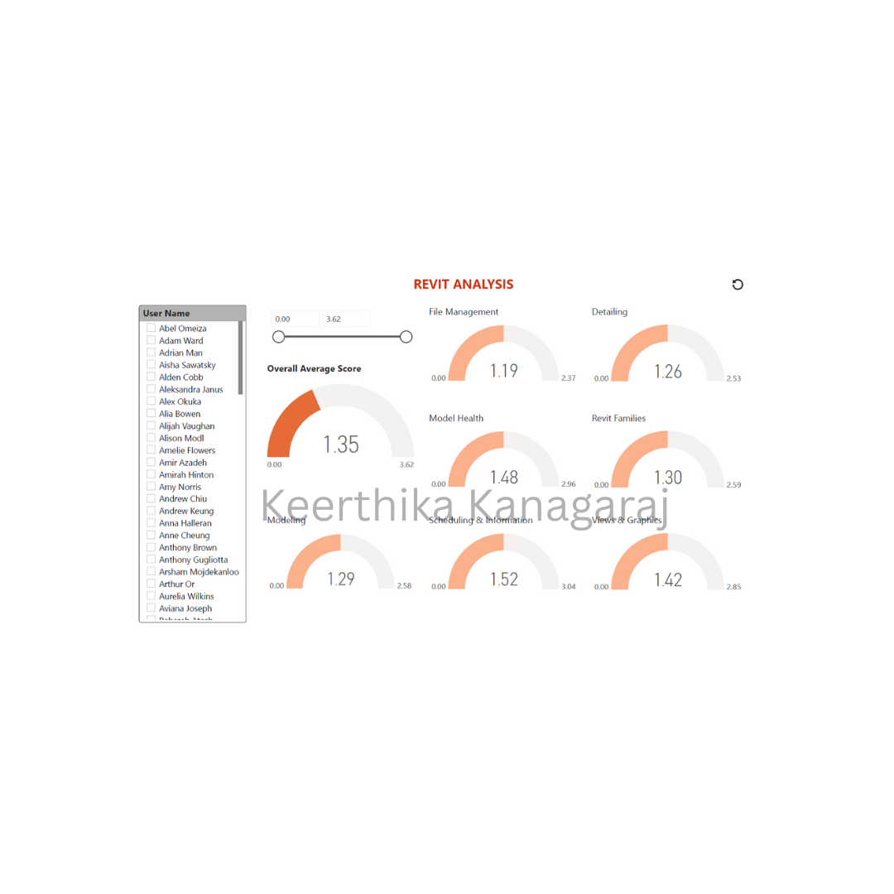

# HRMS Dashboard #

## Key Features ##
- **Skill-based employee shortlisting:** HR can select required skill(s) and skill level, and the table instantly filters to matching employees.
- **Multi-skill + level filtering:** Supports narrowing down candidates by multiple skill categories and proficiency levels for better project-fit.
- **Fast allocation view:** Side-by-side employee vs skill columns makes it easy to compare candidates and pick the right person quickly.
- **Structured skill taxonomy:** Skills are organized in a hierarchy (skill groups → sub-skills) so HR can drill down without confusion.
- **Decision-ready output:** Filtered results can be used directly for allocation discussions (who matches, and at what level).
- **Overall average skill score:** Shows the organization-wide average score to benchmark current capability.
- **Employee-level benchmarking:** Select any user to view their skill scores and compare against overall averages.
- **Category-wise skill breakdown:** Separate gauges for key Revit skill areas (File Management, Modeling, Model Health, Detailing, Families, Scheduling, Views/Graphics).

## Dashboard Preview ##

